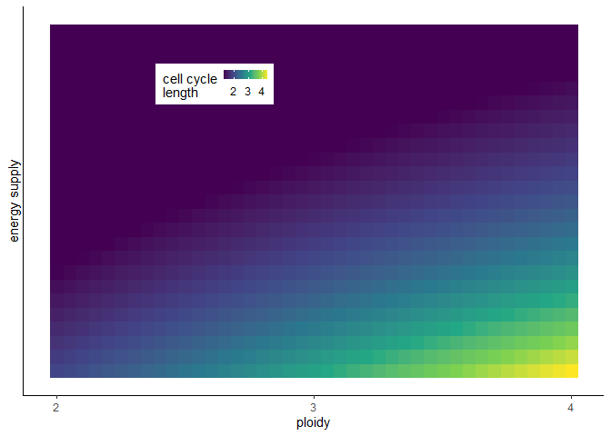
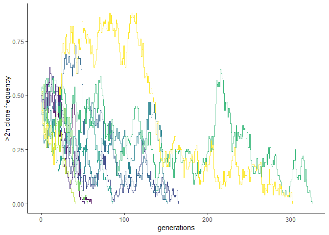
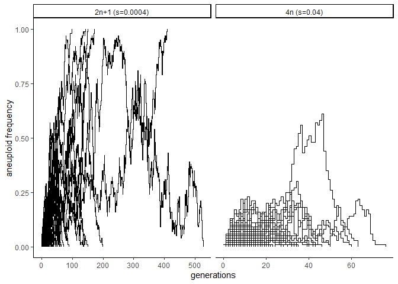
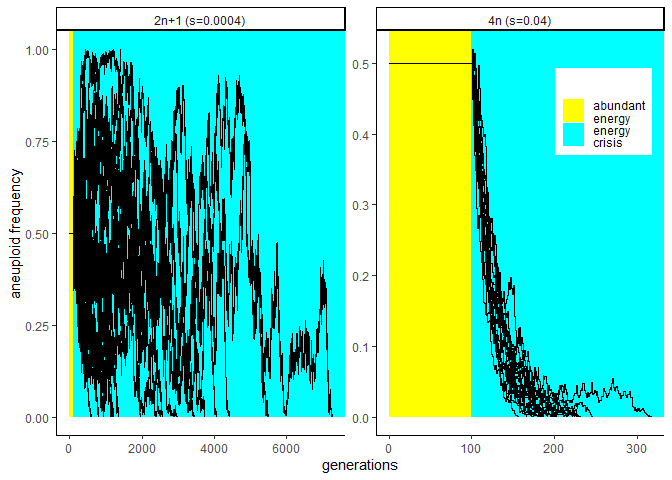
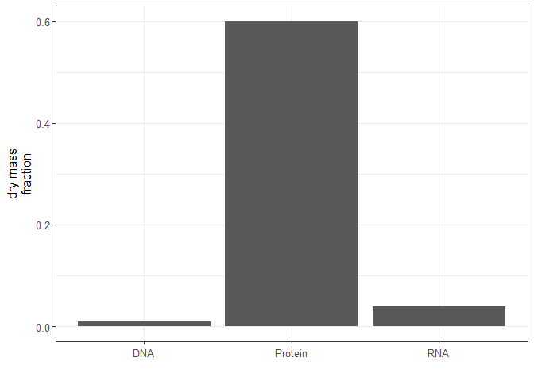
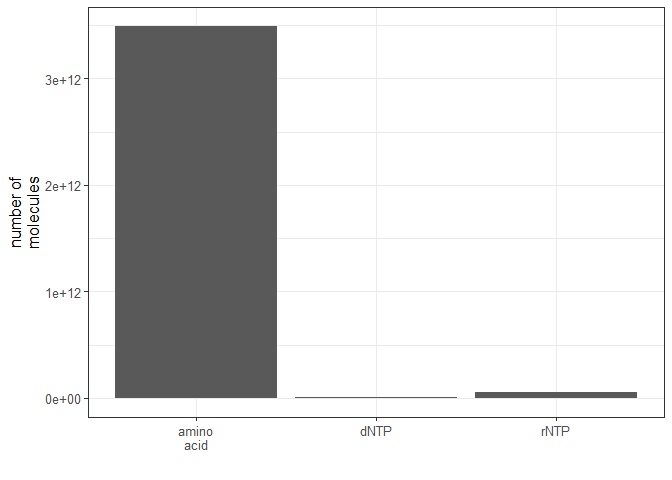
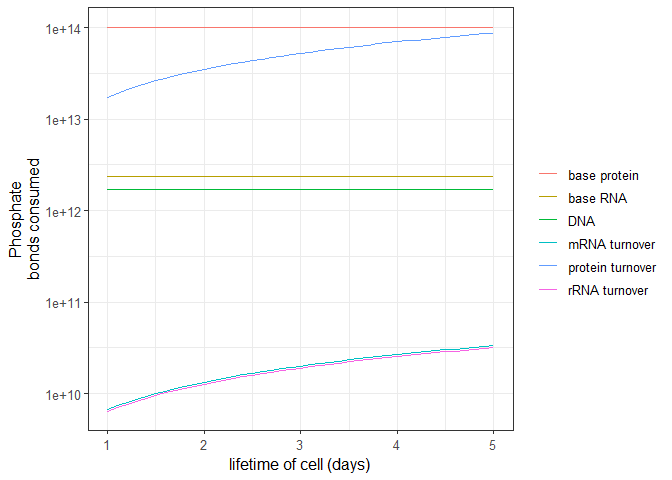
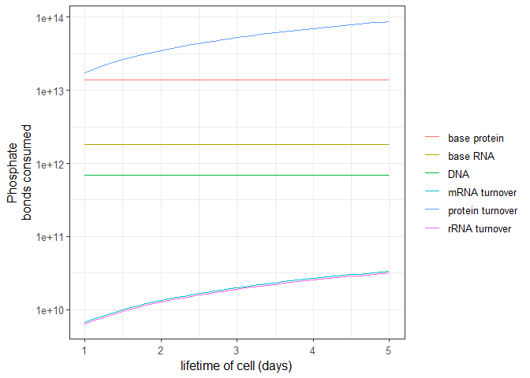
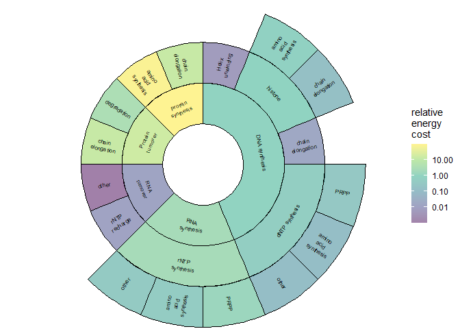

The README.Rmd file contains all code necessary to reproduce results in
the manuscript. To run the code, download the repository, open
README.Rmd in Rstudio, change the root.dir (first chunk) to match your
local directory, then press “Knit”. The expected output should match the
contents of the file README.md. The typical runtime is expected to be a
few seconds on a “normal” desktpop computer.

``` r
base_plot_size=10
library(ggplot2)
```

    ## Warning: package 'ggplot2' was built under R version 4.1.3

Calculation of energy costs of various processes.

Lynch and Marinov calculate energy costs assuming all aminos have to be
synthesized. To modify this for a case when aminos are supplied some
adjustments are required.

1.  Nucleotide synthesis costs. Primary cost in nucleotides is PRPP.
    Cost of PRPP mostly comes from opportunity cost of removing it from
    metabolism (therefore unaffected by amino acid supply). Each
    nucleotide then incorporates 1 amino acid (aspartate for
    pyrimidines, glycine for purines) and a few other steps that cost a
    bit of ATP. Aspartate costs 10P and glycine costs 11P (table S3 of
    <https://doi.org/10.1073/pnas.1514974112> ). Sufficient then to
    deduct 10.5P from each nucleotide cost to model effect of AA supply.

2.  Nucleosomes. Lynch and Marinov calculate the cost of nucleosomes to
    be 160P/BasePair. THis is almost exclusively due to the cost of
    synthesizing histone proteins. Assuming aa’s are free to synthesize,
    we can calculate a reduced cost which is essentially the cost of
    protein elongation (4P/AA):

Histone lengths:

H1: 213 H2a: 130 H2b: 126 H3: 113 H4: 104

With cost of 4 P/AA, substitute into equation S2 from
<https://doi.org/10.1073/pnas.1514974112>:

``` r
naa_nucleosome <- 0.0056*(213+2*(130+126+113+104))

## cost_nucleosome = 160 = naa_nucleosome*(chain_elong(=4)+aa_synthesis_nucleosome)
## rearrange and solve:
aa_synthesis_nucleosome <- 160/naa_nucleosome-4
```

Functions to calculate energy costs of each process:

``` r
dna_cost <- function(aa){
  
  ##returns cost per base pair  
  nucleotide_cost <- 2*(39.5+10.5*(1-aa))
  histone_cost <- (4+aa_synthesis_nucleosome*(1-aa))*naa_nucleosome 
  okazaki_cost <- 3
  nucleotide_cost + histone_cost + okazaki_cost
}

rna_cost <- function(aa){
  ##returns cost per nucleotide
  nucleotide_cost <- (35.5+10.5*(1-aa))
}

## aa_supply ranges from 0 (cells have to synthesize every amino acid) to
## 1 (cells don't have to synthesize at all). 
new_cell_cost <- function(ploidy=2,aa_supply=0){ 
  
  ##Ploidy has units G/CELL
  
  ## this is # of Base pairs in one (haploid) copy of the genome
  N_base_pairs <- 3.2*10^9 ##BP/G
  
  base_pair <- dna_cost(aa_supply) ## (Units: P/BP)
  dna <- ploidy*base_pair*N_base_pairs 
  ## Check units: (G/C)*(P/BP)*(BP/G) = (P/C) 
  
  rel_weight_rna <- 1 ## assume dNTP and rNTP weigh same (gN/gN = dimless)
  mass_frac_rna <- 4 ## g/C / g/C = dimless
  
  ## 2 in here is conversion from BP to nucleotide
  rntp_size <- ploidy*2*N_base_pairs*rel_weight_rna*mass_frac_rna 
  # (G/C)*(N/BP)*(BP/G) = (N/C)
  rntp <- rna_cost(aa_supply) # P/N
  rna <- rntp*rntp_size #  P/C
  
  aa_cost <- 25*(1-aa_supply) ## P/aa
  rel_weight_aa <- 500/110 ## (g/N)/(g/aa) = aa/N
  mass_frac_protein <- 60  ##(g/g) = dimless
  aa_size <- mass_frac_protein*rel_weight_aa*ploidy*2*N_base_pairs
  ## (aa/N)*(G/C)*(N/BP)*(BP/G) = (aa/C) 
  elong_cost <- 4 # P/aa
  protein <- (aa_cost+elong_cost)*aa_size #(P/C)
  
  total <- dna+rna+protein
  
  data.frame(total,dna,rna,protein)

}

ongoing_cost <- function(ploidy=2){ 
  
  ##Ploidy has units G/CELL
  
  ## this is # of Base pairs in one (haploid) copy of the genome
  N_base_pairs <- 3.2*10^9 ##BP/G
  
  rel_weight_rna <- 1 ## assume dNTP and rNTP weigh same (gN/gN = dimless)
  mass_frac_rna <- 4 ## g/C / g/C = dimless
  ## 2 in here is conversion from BP to nucleotide (units: N/BP)
  rntp_size <- ploidy*2*N_base_pairs*rel_weight_rna*mass_frac_rna 
  # (G/C)*(N/BP)*(BP/G) = (N/C)
  rntp <- 2.17 # P/N
  rna <- rntp*rntp_size #  P/C
  
  mrna_frac <- 0.05 #dimless
  mrna_deg <- 24/(10*2) ## (1/d)
  mrna <- rna*mrna_frac*mrna_deg ## ## P/(C*d)

  rrna_frac <- 0.8 #(dimless)
  rrna_deg <- 1/14 #(1/d)
  rrna <- rna*rrna_frac*rrna_deg ## P/(C*d)
  
  aa_cost <- 25 ## P/aa
  rel_weight_aa <- 500/110 ## (g/N)/(g/aa) = aa/N
  mass_frac_protein <- 60  ##(g/g) = dimless
  aa_size <- mass_frac_protein*rel_weight_aa*ploidy*2*N_base_pairs
  ## (aa/N)*(G/C)*(N/BP)*(BP/G) = (aa/C) 
  elong_cost <- 4 # P/aa
  rec_cost <- 1 #P/aa
  prot_deg <- 1 # 1/d
  protein <- prot_deg*aa_size*(rec_cost+elong_cost) ## P/(C*d)
  
  total <- mrna+rrna+protein
  
  data.frame(total,mrna,rrna,protein)

}

other_costs <- function(base,ongoing,frac=0.5,days=2){
  ## Assume that a cell with cell cycle time = days spends a fraction (frac)
  ## of its energy on other costs e.g. ion pumping.  
  e1 <- (base+ongoing*days)/days
  etot <- e1/(1-frac)
  etot*frac
}

##compute the cell cycle time
cctime <- function(ploidy,e0,u,aa_supply=0){
  
  ongoing <- as.matrix(ongoing_cost(ploidy))
  if(length(ploidy)==1) ongoing <- ongoing[1,1]
  if(length(ploidy)==3) ongoing <- sum(c(ongoing[2,2:3],ongoing[3,4])) 

  spare_energy <- u-(ongoing+e0)
  if(spare_energy<=0) return(Inf)

  b <- as.matrix(new_cell_cost(ploidy,aa_supply = aa_supply))
  if(length(ploidy)==1) b <- b[1,1]
  if(length(ploidy)==3) b <- sum(diag(b[,-1]))
  
  b/spare_energy
  
}
```

Energy cost heatmap

``` r
make_row <- function(u,u0){
  uz <- u
  u <- u*u0
  bd <- new_cell_cost()$total
  od <- ongoing_cost()$total
  t0 <- bd/(u0-od)
  
  ploidy <- seq(2,4,0.05)
  r <- sapply(ploidy, function(pli){
    ba <- new_cell_cost(ploidy=(pli))$total
    oa <- ongoing_cost(ploidy=(pli))$total
    ba/(u-oa)
  })/t0
  data.frame(u=uz,ploidy=ploidy,r=r)
}
u0 <- 3e+14
u <- exp(seq(-0.6,0.6,0.05))
df <- do.call(rbind,lapply(u,make_row,u0=u0)) 


p <- ggplot(df,aes(x=ploidy,y=u,fill=pmax(1.3,r)))+
  geom_raster()+
  scale_y_log10("energy supply",breaks=NULL)+
  scale_fill_viridis_c("cell cycle\nlength")+
  theme_classic()+
  scale_x_continuous("ploidy",breaks=2:4)+
  theme(legend.position = c(0.33,0.8),legend.direction = "horizontal",
        legend.key.size = unit(0.1,"in"))
p
```



``` r
#ggsave("duration_heatmap.png",width=3,height=3,units="in")
```

Cell cycle delays and selection coefficients (presented in table):

``` r
bd <- new_cell_cost()
od <- ongoing_cost()

## Base case: cell cycle time 2 days, diploid cell. 
e0 <- other_costs(new_cell_cost()$total,ongoing_cost()$total,frac = 0.5,days=2)
u <- bd$total/2 + e0+od$total
t0 <- cctime(2,e0,u)

f_a_dna <- t0/cctime(ploidy=c(2+1/44,2,2),e0=e0,u=u)
f_t_dna <- t0/cctime(c(2+2,2,2),e0,u)

f_a_rna <- t0/cctime(c(2,2+1/44,2),e0,u)
f_t_rna <- t0/cctime(c(2,2+2,2),e0,u)

f_a_na <- t0/cctime(c(2+1/44,2+1/44,2),e0,u)
f_t_na <- t0/cctime(c(2+2,2+2,2),e0,u)

f_a_pro <- t0/cctime(c(2,2,2+1/44),e0,u)
f_t_pro <- t0/cctime(c(2,2,2+2),e0,u)

f_a_tot <- t0/cctime(2+1/44,e0,u)
f_t_tot <- t0/cctime(2+2,e0,u)

df <- data.frame(f=c(f_a_dna,f_t_dna,f_a_rna,f_t_rna,f_a_na,f_t_na,f_a_pro,f_t_pro,f_a_tot,f_t_tot),
           id=rep(c("aneuploid","tetraploid"),5),
           process=c("dna","dna","rna","rna","nucleic acid","nucleic acid","protein","protein","total","total"))

df$s <- 1-df$f
df$Nstrong <- 1/df$s
df$N <- 2/df$s
df$Nweak <- 4/df$s
```

Various Specific numbers given in the perspective:

``` r
##base costs
e0 <- other_costs(new_cell_cost()$total,ongoing_cost()$total,frac = 0.5,days=2)
etot <- e0 + new_cell_cost()$total/2 + ongoing_cost()$total

# % of energy budget spent on RNA (ongoing)
100*sum(ongoing_cost(2)[2:3])/etot
```

    ## [1] 0.009282541

``` r
# % of energy budget spent on DNA (new cell)
0.5*100*new_cell_cost(2)[2:3]/etot
```

    ##        dna       rna
    ## 1 0.600243 0.8398837

``` r
# % of energy budget spent on protein (ongoing)
100*ongoing_cost(2)[4]/etot
```

    ##    protein
    ## 1 12.44887

``` r
# % of budget on protein (new cell)
0.5*100*new_cell_cost(2)[4]/etot
```

    ##    protein
    ## 1 36.10172

Extra energy supply required

``` r
##base costs
e0 <- other_costs(new_cell_cost()$total,ongoing_cost()$total,frac = 0.5,days=2)
etot <- e0 + new_cell_cost()$total/2 + ongoing_cost()$total

# % of energy budget spent on RNA (ongoing)
100*sum(ongoing_cost(2)[2:3])/etot
```

    ## [1] 0.009282541

``` r
# % of energy budget spent on DNA (new cell)
0.5*100*new_cell_cost(2)[2:3]/etot
```

    ##        dna       rna
    ## 1 0.600243 0.8398837

``` r
# % of energy budget spent on protein (ongoing)
100*ongoing_cost(2)[4]/etot
```

    ##    protein
    ## 1 12.44887

``` r
# % of budget on protein (new cell)
0.5*100*new_cell_cost(2)[4]/etot
```

    ##    protein
    ## 1 36.10172

Expected time to fixation.

``` r
i1 <- function(xi,S){
  (exp(2*S*xi)-1)*(exp(-2*S*xi)-exp(-2*S))/(xi*(1-xi))
}

i2 <- function(xi,S){
  (exp(2*S*xi)-1)*(1-exp(-2*S*xi))/(xi*(1-xi))
}

J1 <- function(s,Ne,p){
  S <- s*Ne
  2/(s*(1-exp(-2*S)))*integrate(f=i1,lower=p,upper=1,S=S)$value
}
J2 <- function(s,Ne,p){
  S <- s*Ne
  2/(s*(1-exp(-2*S)))*integrate(f=i2,lower=0,upper=p,S=S)$value
}

u <- function(p,S) (1-exp(-2*S*p))/(1-exp(-2*S))

## commented out code is a validation that our code gives the same results as Mutoo Kimura's example
#Ne <- 10
#p <- 0.1
#ss <- (1:9)/10
#t <- sapply(ss, function(s){
  #S <- s*Ne
  #J1(s,Ne,p)+(1-u(p,S))/u(p,S)*J2(s,Ne,p)
#})
#plot(ss,t) 

## using selection coefficients from the previous data frame and assuming a diploid mutant in a population of aneuploids:
Ne <- 100
p <- 1/Ne
t <- sapply(df$s, function(s){
    S <- s*Ne
    tryCatch(J1(s,Ne,p)+(1-u(p,S))/u(p,S)*J2(s,Ne,p),
             error=function(e) return(NaN))
})
```

Monte carlo sims to calculate expected times to fixation:

``` r
mcs <- function(s,Ne=1000,p=0.5){
  x <- c(round(Ne*p),Ne-round(Ne*p))
  t <- 0
  while(min(x)>0){
    px <- x[1]*(1-s)/sum(x)
    x[1] <- rbinom(n = 1,size=Ne,p=px)
    x[2] <- Ne-x[1]
    t <- t+1
  }
  data.frame(time=t,winner=which.max(x))
}

wrap_mc <- function(s,Ne=10000,p=0.5,Nruns=10000){
  df <- do.call(rbind,pbapply::pblapply(1:Nruns,function(i) mcs(s,Ne,p)))
  data.frame(s=s,time=mean(df$time[df$winner==2]),frac_win=mean(df$winner==2))
}

mcdf <- do.call(rbind,lapply(df$s,wrap_mc))

 x <- cbind(df,time=mcdf[,2])
write.csv(x,"summary_df.csv",row.names = F)
print(x)
```

    ##            f         id      process            s     Nstrong            N
    ## 1  0.9998183  aneuploid          dna 0.0001816570 5504.881135 11009.762269
    ## 2  0.9842629 tetraploid          dna 0.0157371013   63.544104   127.088208
    ## 3  0.9997430  aneuploid          rna 0.0002569709 3891.490887  7782.981773
    ## 4  0.9778758 tetraploid          rna 0.0221242283   45.199317    90.398633
    ## 5  0.9995615  aneuploid nucleic acid 0.0004385351 2280.319409  4560.638817
    ## 6  0.9628184 tetraploid nucleic acid 0.0371815972   26.895025    53.790051
    ## 7  0.9854630  aneuploid      protein 0.0145370424   68.789783   137.579567
    ## 8  0.3407355 tetraploid      protein 0.6592644701    1.516842     3.033684
    ## 9  0.9850354  aneuploid        total 0.0149645734   66.824491   133.648982
    ## 10 0.3340765 tetraploid        total 0.6659235174    1.501674     3.003348
    ##           Nweak      time
    ## 1  22019.524538 9485.3129
    ## 2    254.176415  357.4838
    ## 3  15565.963546 7765.7480
    ## 4    180.797266  265.8735
    ## 5   9121.277634 5379.5409
    ## 6    107.580101  170.4533
    ## 7    275.159133  380.8476
    ## 8      6.067368    8.7369
    ## 9    267.297963  370.2906
    ## 10     6.006696    8.5740

Example MCS visulaization:

``` r
mcs_viz <- function(s,Ne=1000,p=0.5){
  x <- c(round(Ne*p),Ne-round(Ne*p))
  t <- 0
  df<- data.frame(t,n=x[1])
  while(min(x)>0){
    px <- x[1]*(1-s)/sum(x)
    x[1] <- rbinom(n = 1,size=Ne,p=px)
    x[2] <- Ne-x[1]
    t <- t+1
    dfx <- data.frame(t,n=x[1])
    df <- rbind(df,dfx)
  }
  df$x <- df$n/Ne
  return(df)
}


Ne <- 100
p <- 0.5
Nreps <- 10

s <- 0.01
df <- do.call(rbind,lapply(1:Nreps, function(n){
  dfi <- mcs_viz(s,Ne,p)
  dfi$rep <- n
  dfi
}))


p <- ggplot(df,aes(x=t,y=x,group=rep,color=as.character(rep)))+
  geom_step(show.legend = F,size=0.2)+
  scale_y_continuous(">2n clone frequency")+
  scale_x_continuous("generations")+
  scale_color_viridis_d()+
  theme_classic()
p
```



``` r
#ggsave("mcs_example.png",width=2.5,height=2,units="in")
```

Main Figure

``` r
set.seed(42)
mcs_viz <- function(s,Ne=1000,p=0.5){
  x <- c(round(Ne*p),Ne-round(Ne*p))
  t <- 0
  df<- data.frame(t,n=x[1])
  while(min(x)>0){
    px <- x[1]*(1-s)/sum(x)
    x[1] <- rbinom(n = 1,size=Ne,p=px)
    x[2] <- Ne-x[1]
    t <- t+1
    dfx <- data.frame(t,n=x[1])
    df <- rbind(df,dfx)
  }
  df$x <- df$n/Ne
  return(df)
}


Ne <- 100
p <- 1/Ne
Nreps <- 500

s <- 0.04
df1 <- do.call(rbind,lapply(1:Nreps, function(n){
  dfi <- mcs_viz(s,Ne,p)
  dfi$rep <- n
  dfi
}))
df1$id <- "4n (s=0.04)"

s <- 0.0004
df2 <- do.call(rbind,lapply(1:Nreps, function(n){
  dfi <- mcs_viz(s,Ne,p)
  dfi$rep <- n
  dfi
}))
df2$id <- "2n+1 (s=0.0004)"

df <- rbind(df1,df2)

p1 <- ggplot(df,aes(x=t,y=x,group=rep))+
  facet_wrap(~id,scales="free_x")+
  geom_step()+
  scale_y_continuous("aneuploid frequency")+
  scale_x_continuous("generations")+
  theme_classic()
p1
```



``` r
Ne <- 1000
p <- 0.5
Nreps <- 20
s <- 0.04
df1 <- do.call(rbind,lapply(1:Nreps, function(n){
  dfi <- mcs_viz(s,Ne,p)
  dfi$rep <- n
  dfi$t <- dfi$t+100
  dfi <- rbind(dfi[1,],dfi)
  dfi$t[1]<-0
  dfi
}))


df1$id <- "4n (s=0.04)"
s <- 0.0004
df2 <- do.call(rbind,pbapply::pblapply(1:Nreps, function(n){
  dfi <- mcs_viz(s,Ne,p)
  dfi$rep <- n
  dfi$t <- dfi$t+100
  dfi <- rbind(dfi[1,],dfi)
  dfi$t[1]<-0
  dfi
}))
df2$id <- "2n+1 (s=0.0004)"

df <- rbind(df1,df2)
p2 <- ggplot(df,aes(x=t,y=x,group=rep))+
  facet_wrap(~id,scales="free")+
  geom_rect(xmin=0,xmax=100,ymin=0,ymax=Inf,aes(fill="abundant\nenergy"))+
  geom_rect(xmin=100,xmax=Inf,ymin=0,ymax=Inf,aes(fill="energy\ncrisis"))+
  geom_step()+
  scale_y_continuous("aneuploid frequency")+
  scale_x_continuous("generations")+
  theme_classic()+
  theme(legend.position = c(0.9,0.8))+
  scale_fill_manual("",values=c("yellow","cyan"))
p2
```



``` r
#p <- cowplot::plot_grid(p1,p2,nrow=2,labels=c("A","B"))
#ggsave("mcs_figs.png",plot=p,width=7,height=7,units="in")
```

1.  Mass fractions of the cell:

``` r
options(scipen=0, digits=7)
base_plot_size <- 12
df1 <- data.frame(type=c("DNA","RNA","Protein"),
                 weight=c(0.01,0.04,0.6))

df2 <- data.frame(type=c("dNTP","rNTP","amino\nacid"),
                 nmol = c(12.8*10^9,
                          4*12.8*10^9,
                          60*(500/110)*12.8*10^9))


p1 <- ggplot(df1,aes(x=type,y=weight))+
  geom_col()+
  scale_x_discrete("")+
  scale_y_continuous("dry mass\nfraction")+
  theme_bw(base_size=base_plot_size)
p1
```



``` r
p2 <-  ggplot(df2,aes(x=type,y=nmol))+
  geom_col()+
  scale_x_discrete("")+
  scale_y_continuous("number of\nmolecules")+
  theme_bw(base_size=base_plot_size)
p2
```



``` r
bd <- new_cell_cost()
od <- ongoing_cost()

df <- do.call(rbind,lapply(seq(1,5,0.1), function(t){
  df <- data.frame(p0=bd$protein,pt=od$protein*t,
           dna=bd$dna,
           rna0=bd$rna,
           mrnat=od$mrna*t,
           rrnat=od$rrna*t,
           t=t)
  return(df)
}))

df <- reshape2::melt(df,id.vars="t")

lablr <- c(dna="DNA",rna0="base RNA",mrnat="mRNA turnover",
                                   rrnat="rRNA turnover",p0="base protein",
                                   pt="protein turnover")
df$v2 <- lablr[as.character(df$variable)]

paa <- ggplot(df,aes(x=t,y=value,color=v2))+
  geom_line()+
  scale_y_log10("Phosphate\nbonds consumed")+
  scale_x_continuous("lifetime of cell (days)")+
  scale_color_discrete("")+
  theme_bw(base_size=base_plot_size)
paa
```



``` r
bd <- new_cell_cost(aa_supply = 1)

df <- do.call(rbind,lapply(seq(1,5,0.1), function(t){
  df <- data.frame(p0=bd$protein,pt=od$protein*t,
           dna=bd$dna,
           rna0=bd$rna,
           mrnat=od$mrna*t,
           rrnat=od$rrna*t,
           t=t)
  return(df)
}))

df <- reshape2::melt(df,id.vars="t")

lablr <- c(dna="DNA",rna0="base RNA",mrnat="mRNA turnover",
                                   rrnat="rRNA turnover",p0="base protein",
                                   pt="protein turnover")
df$v2 <- lablr[as.character(df$variable)]

pnaa <- ggplot(df,aes(x=t,y=value,color=v2))+
  geom_line()+
  scale_y_log10("Phosphate\nbonds consumed")+
  scale_x_continuous("lifetime of cell (days)")+
  scale_color_discrete("")+
  theme_bw(base_size=base_plot_size)
pnaa
```

 Option 2

Use previous estimates

Standard metabolic rate (SMR) is the steady-state rate of heat
production by a whole organism under a set of “standard” conditions.

DNA/RNA synthesis (inhibited using e.g. actinomycin or amanatin):
Contribution to oxygen consumption: 12% (resting lymphocytes, Ehrlic
mouse ascites tumor cells), 0% (resting thymocytes)

RNA synthesis (radiolabelled nucleotides to estimate RNA synthesis rate,
assuming 2ATP per nucleotide): Contribution to oxygen consumption: 1%
(thymocytes) 5% (rat liver) Contribution to ATP consumption: 1%
(thymocytes) 10% (rat liver)

<https://doi.org/10.1152/physrev.1997.77.3.731>

Buttgereit data (stimulated thymocytes) RNA/DNA synthesis: 0.25 protein
synthesis: 0.34

Estimates from microbial cells DNA - 2% protein - 75%
<https://doi.org/10.1038/nature09486>

``` r
t <- 2

dfa <- data.frame(m=c("Protein","DNA","RNA"),
                 f=c((bd$protein+od$protein*t),bd$dna,(bd$rna+od$mrna*t)),
                 id="estimate")
dfa$f <- 0.5*dfa$f/sum(dfa$f)

df <- data.frame(m=c(rep("DNA",1),rep("RNA",2),rep("RNA/DNA",4),rep("Protein",3)),
                 f=c(0.02,0.01,0.1,0.12,0.12,0,0.25,0.34,0.75,0.9),
                 id="literature")

#dfc <- rbind(df,dfa,dfb)
dfc <- rbind(df,dfa)

pcomp <- ggplot(dfc,aes(x=m,y=f,color=id))+
  geom_jitter(height=0,width=0.1)+
  scale_x_discrete("")+
  scale_y_continuous("fraction of\nenergy budget")+
  scale_color_discrete("",labels=c("estimate","literature"))+
  theme_bw(base_size=base_plot_size)
pcomp
```


``` r
library(ggsunburst)
```

    ## Loading required package: reticulate

    ## Warning: package 'reticulate' was built under R version 4.1.3

``` r
sb <- sunburst_data('subprocesses.csv', sep = ",", type = "node_parent", ladderize=F,node_attributes = "total")

lablr <- c('DNA synthesis'="DNA synthesis",
'RNA synthesis'="RNA\nsynthesis",
'RNA turnover'="RNA\nturnover",
'Protein turnover'="Protein\nturnover",
'Protein synthesis'="Protein\nsynthesis",
'helix unwinding'="Helix\nunwinding",
'histone'="histone",
'aa synthesis'="amino\nacid\nsynthesis",
'chain elongation'="chain\nelongation",
'RNA primers'="RNA primers",
'rNTP synthesis'="rNTP\nsynthesis",
'PRPP'="PRPP",
'glyc/asp. Synthesis'="amino\nacid\nsynthesis",
'other inputs'="other",
'dNTP synthesis'="dNTP synthesis",
'rNTP recharge'="rNTP\nrecharge",
'nucleosome dissassembly'="other",
'degredation'="degradation")
sb$node_labels$label <- lablr[sb$node_labels$label]
sb$leaf_labels$label <- lablr[sb$leaf_labels$label]
sb$node_labels$pvjust <- 0.5
sb$rects$total <- sb$rects$total/sb$rects$total[sb$rects$name=="DNA synthesis"]
# plot
pburst <- sunburst(sb, node_labels = T, node_labels.min = 10, rects.fill.aes = "total",show)+
  scale_fill_viridis_c("relative\nenergy\ncost",alpha=0.5,trans="log",breaks=c(0.01,0.1,1,10,100))+
  theme(plot.background = element_rect(fill = "white",color="white"),
        panel.background =  element_rect(fill = "white",color="white"),
        panel.border = element_rect(fill=NA,color=NA),
        plot.margin = margin(t = -2,r=0.1,b=-2,unit = "in"),
              panel.grid.major = element_blank(), 
      panel.grid.minor = element_blank())
pburst
```



``` r
  #scale_y_continuous(expand = expansion(mult = c(0, -0.1)))+
#ggsave("sunburst.png",plot=pburst,width=5,height=5,units="in")
```

Rstudio version: (RStudio 2023.03.0+386 “Cherry Blossom” Release
(3c53477afb13ab959aeb5b34df1f10c237b256c3, 2023-03-09) for Windows
Mozilla/5.0 (Windows NT 10.0; Win64; x64) AppleWebKit/537.36 (KHTML,
like Gecko) RStudio/2023.03.0+386 Chrome/108.0.5359.179 Electron/22.0.3
Safari/537.36)

Packages version info:

``` r
print(sessionInfo())
```

    ## R version 4.1.0 (2021-05-18)
    ## Platform: x86_64-w64-mingw32/x64 (64-bit)
    ## Running under: Windows 10 x64 (build 19044)
    ## 
    ## Matrix products: default
    ## 
    ## locale:
    ## [1] LC_COLLATE=English_United States.1252 
    ## [2] LC_CTYPE=English_United States.1252   
    ## [3] LC_MONETARY=English_United States.1252
    ## [4] LC_NUMERIC=C                          
    ## [5] LC_TIME=English_United States.1252    
    ## 
    ## attached base packages:
    ## [1] stats     graphics  grDevices utils     datasets  methods   base     
    ## 
    ## other attached packages:
    ## [1] ggsunburst_0.3.0 reticulate_1.25  ggplot2_3.3.6   
    ## 
    ## loaded via a namespace (and not attached):
    ##  [1] tidyselect_1.1.2  xfun_0.31         purrr_0.3.4       reshape2_1.4.4   
    ##  [5] pbapply_1.5-0     lattice_0.20-44   colorspace_2.0-3  vctrs_0.4.1      
    ##  [9] generics_0.1.3    htmltools_0.5.5   viridisLite_0.4.0 yaml_2.3.5       
    ## [13] utf8_1.2.2        rlang_1.0.4       pillar_1.8.0      glue_1.6.2       
    ## [17] withr_2.5.0       DBI_1.1.3         lifecycle_1.0.1   plyr_1.8.7       
    ## [21] stringr_1.4.0     munsell_0.5.0     gtable_0.3.0      evaluate_0.15    
    ## [25] labeling_0.4.2    knitr_1.39        fastmap_1.1.0     parallel_4.1.0   
    ## [29] fansi_1.0.3       highr_0.9         Rcpp_1.0.9        scales_1.2.0     
    ## [33] jsonlite_1.8.0    farver_2.1.1      png_0.1-7         digest_0.6.29    
    ## [37] stringi_1.7.6     dplyr_1.0.9       grid_4.1.0        rprojroot_2.0.3  
    ## [41] here_1.0.1        cli_3.3.0         tools_4.1.0       magrittr_2.0.3   
    ## [45] tibble_3.1.8      pkgconfig_2.0.3   Matrix_1.5-4      assertthat_0.2.1 
    ## [49] rmarkdown_2.14    rstudioapi_0.13   R6_2.5.1          compiler_4.1.0
